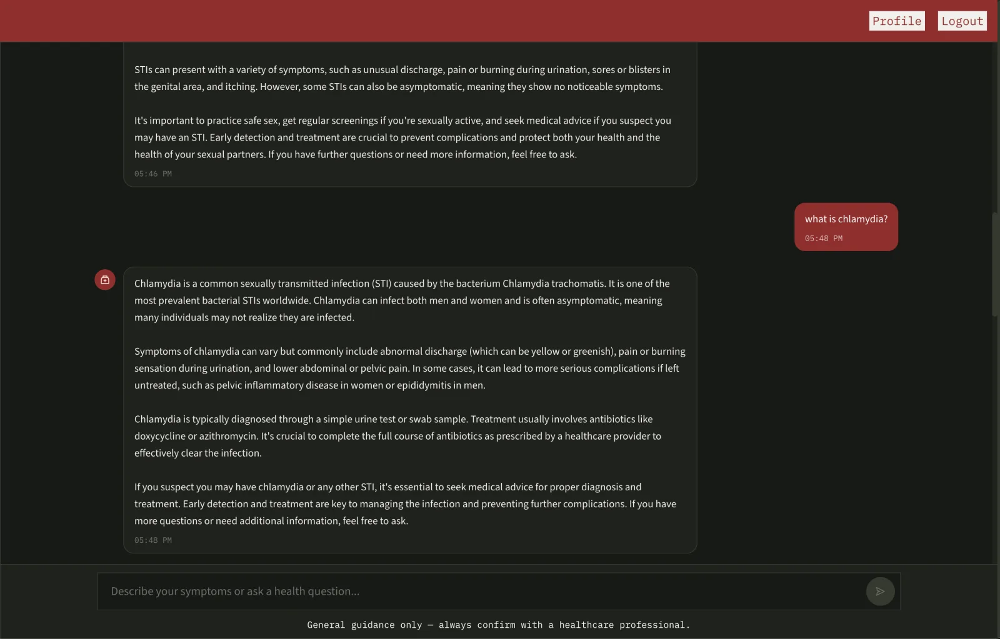
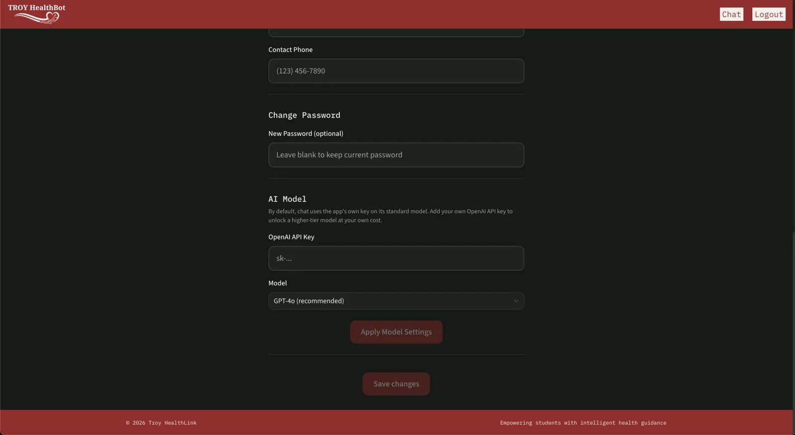

# Troy HealthLink - AI Sexual Health Assistant

A full-stack AI health assistant for Troy University students: a real-time chat that combines a symptom-classification model with retrieval-augmented generation (RAG) over real medical literature, so answers are either grounded in an actual cited source or honestly labeled as general knowledge — never presented as sourced when they aren't.

**Tech Stack:** React 19 + TypeScript (Vite) | FastAPI + Python 3.12 | Supabase (PostgreSQL + Auth + pgvector)  OpenAI (`gpt-4o-mini` by default, or your own key on a higher-tier model + `text-embedding-ada-002`) | XGBoost | Docker | Render + Vercel | GitHub Actions CI

[Architecture diagram](docs/architecture.html) (open locally in a browser - it's interactive HTML, which GitHub only shows as raw source).

## Screenshots

### **Homepage**


### **Chat**


### **Profile**


## How It Works

1. **Chat** — a message is saved, then checked against the vector store; if a real, relevant document chunk is found (above a similarity threshold), it's injected into the prompt with a hard citation requirement (`[Source: filename.pdf, Chunk: X]`, inline, every time — not only when asked). If nothing relevant is found, the model answers from general knowledge with no citation implied. Replies stream token-by-token over a WebSocket.

2. **Symptom analysis** — once the conversational model judges it has enough information, the last several user messages are run through negation-aware feature extraction (regex/keyword matching) and fed to a trained XGBoost classifier, which returns a predicted condition plus a full probability distribution across all 6 it knows.

3. **Diagnosis-specific RAG** — a second, focused lookup ("What is [predicted condition]? Symptoms, treatment...") searches the vector store specifically for that condition. If real documents are found, they're cited by filename; if not, the reply falls back to a small hardcoded knowledge base and must say so honestly rather than inventing a source.

4. **Document ingestion** — PDFs are text-extracted (OCR as a fallback for scanned documents only), chunked, embedded via OpenAI, and stored in Supabase's pgvector column. Currently: 8 PDFs, 95 chunks (`GET /rag/stats` for the live count).

The backend is layered: `routers/` only validate requests and call into `services/`, which hold the actual business logic (RAG lookups, the ML call, prompt construction), independent of HTTP/WebSocket concerns. `db.py` is the one place that talks to Supabase for session/message data.

## The ML Model

- **Type:** XGBoost (gradient-boosted trees).
- **Classes (6):** BV, Chlamydia, Gonorrhea, Herpes, UTI, Healthy.
- **Training data:** 100,000 rows (80k train / 20k test), generated by `generate_data.py` — a rule-based synthetic patient generator using clinically-informed per-condition symptom probabilities. **Not real patient data due to confidential reasons.**
- **Measured accuracy** (from the actual training run, `training_report.json`): **61.83% top-1, 73.8% top-2.** This measures the classifier on clean, structured input — real-world accuracy is bounded by the much simpler text-to-feature extraction step, not the classifier itself.

`generate_data.py`'s code defines probabilities for 16 conditions, but the currently trained model only covers 6 — a known, deliberate scope, not an accidental gap.

**A second, standalone prediction API:** `POST /predict` and `/predict/followup` are a separate surface from the chat flow above — the chat's clarifying questions come from the LLM in natural language, but `/predict` picks its next follow-up question itself, using [Expected Information Gain](https://en.wikipedia.org/wiki/Information_gain_(decision_tree)) over `P(symptom|disease)` (`eig_utils.py`): given the current top predictions, it asks whichever unanswered symptom would most reduce uncertainty between them, rather than asking in a fixed order. It also applies temperature-scaled probability calibration (`services/prediction_logic.py`), though the shipped model uses `T=1.0` (no-op) since it wasn't found to need adjusting. The chat UI doesn't call this endpoint — it exists as an independent, directly-testable ML API (see `test_performance.py`).

## Account & Model Choice

- **Auth:** email/password signup and login via Supabase Auth, with a full forgot-password/reset-password flow (`/auth/forgot-password`, `/auth/reset-password`) - the same generic response either way, so the endpoint can't be used to check which emails are registered.
- **Rate limiting:** `slowapi`, in-memory, per-IP. Login: 5/minute. Forgot-password: 3/minute (it sends real email). Chat: 20 messages/minute per user.
- **Bring your own API key:** Profile → "AI Model" lets a student add their own OpenAI API key and pick a model (`gpt-4o`, `gpt-4o-mini`, `gpt-4-turbo`) - billed to their own account, validated live against OpenAI before it's saved. With no key on file, chat uses the app's own key on `gpt-4o-mini`. Scoped to chat completions only - RAG's embeddings always use the app's own key.

## Testing & CI

`backend/tests/` - pytest, run on every push/PR via GitHub Actions: app-startup route checks, password-strength validation, and negation-aware symptom-extraction tests. The `backend/test_*.py` scripts at the repo root are manual benchmarks/diagnostics instead (need real Supabase/OpenAI credentials, not suited to CI) - chat latency, a concurrency regression test, and raw model/RAG performance.

## Getting Started

**Backend:**
```bash
cd backend
python3 -m venv .venv && source .venv/bin/activate
pip install -r requirements.txt
cp app/.env.example app/.env   # fill in real values
cd app && uvicorn main:app --reload
```

**Frontend:**
```bash
cd frontend
npm install
cp .env.example .env   # set VITE_API_URL
npm run dev
```

**Docker** (matches how it's actually deployed):
```bash
cd backend
docker build -t troy-healthlink-backend .
docker run -p 8000:8000 --env-file app/.env troy-healthlink-backend
```

`backend/app/.env.example` and `frontend/.env.example` are the source of truth for required environment variables.

## Performance

Measured locally with `backend/test_performance.py` (methodology in the script — re-run against the deployed instance before quoting these anywhere):

| Measurement | Result |
|---|---|
| Raw XGBoost inference | ~8.6ms mean, ~116 predictions/sec single-threaded |
| `/predict` end-to-end | ~31ms median |
| `/predict` under 10 concurrent requests | ~47 requests/sec |
| `/rag/ask` (includes an OpenAI call) | ~3.4s median — dominated by OpenAI's own latency |

## License

MIT - see [LICENSE](LICENSE).